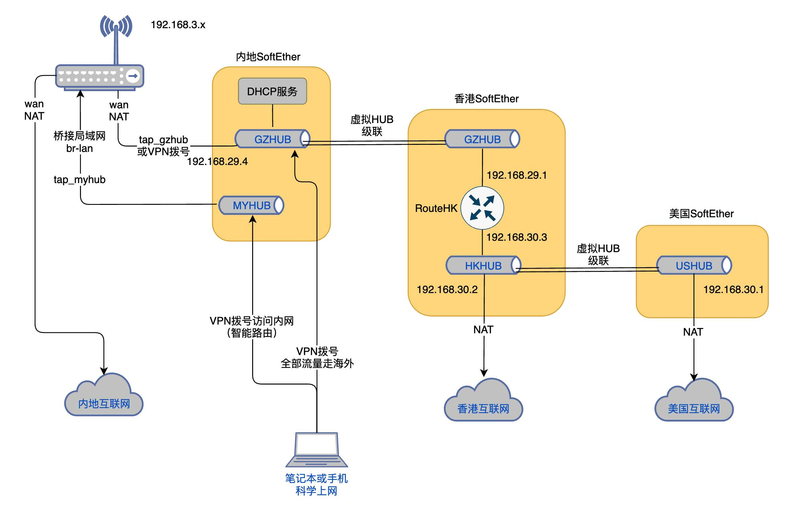

#### SoftEther配置案例

##### 目标

* 局域网设备流量根据域名白智能选择路由：
  1. 不在域名白名单中的域名走内地互联网出口
  2. 在白名单中的域名，需要香港加速的走香港出口，其它走美国出口
* 移动设备可以拨号方式访问局域网（同时实现智能路由）
* 当临时希望所有网络流量都走海外路由时，可以通过拨号解决

#### 网络结构说明



* 在内地、香港和美国各部署一台SoftEther服务器，内地级联到香港，香港级联到美国
* 香港SoftEther上设置两个虚拟Hub，中间加一个三层路由，在路由器上配置路由策略，让需要香港加速的IP从香港出口短路出去
* 内地SoftEther上的GZHUB通过tap_gzhub连接路由器，路由器上配置域名智能路由策略把需要走海外的流量转发到tap_gzhub网卡
* 内地SoftEther上的MYHUB通过tap_myhub与局域网桥接（移动设备可以VPN拨号到MYHUB访问局域网）
* 移动用户还可以直接拨号到内地路由器的GZHUB上，这样就可以实现100%流量经海外出去

##### 内地SoftEther配置（安装在路由器上或与路由器在同一局域网）

* 创建虚拟Hub：GZHUB、MYHUB
* 把GZHUB级联到香港Softether上的GZHUB
* 在GZHUB上开通DHCP（给VPN拨号客户单分配ip地址）

```
- 进入虚拟GZHUB上的SecureNAT配置界面
- 设置主机地址：192.168.29.2/24
- 关闭虚拟NAT
- 配置DHCP参数：默认网关192.168.29.1，DNS1为8.8.8.8，DNS2为1.1.1.1
```

* 把GZHUB级联香港SoftEther服务器的GZHUB
* 把GZHUB连接到路由器

```
如果SoftEther不安装在小米路由器上，配置比较简单，基本可以使用小米原生的智能路由功能：
- 小米路由通过VPN拨号（L2TP模式）与SoftEther上的GZHUB连接
- 因小米路由L2TP拨号不支持Ipset，SoftEther上需要打开RAW L2TP才能被小米路由访问

注：SoftEther自己安装在小米路由时需对其原生的智能路由进行改造。具体方法在后面介绍
```

* 把MYHUB桥接到本地局域网

```
- 在SoftEther上设置，新增一个名为myhub的tap网卡与MYHUB桥接
- 在主机上看到的网卡名为tap_myhub，把它和局域网卡进行桥接
- 此时MYHUB将接入局域网，移动设备通过VPN拨号连接到MYHUB既可加入局域网
  （与局域网其它设备一样享有智能路由上网功能）
```

##### 香港SoftEther配置

* 创建虚拟Hub：GZHUB、HKHUB
* 配置GZHUB

```
- GZHUB仅供内地SoftETher级联使用，无需额外配置（配置好连接用户名和账号即可）
```

* 配置HKHUB

```
- 级联美国SoftEther的USHUB
- 开通SecureNAT，其配置如下
	主机ip：192.168.30.2/255.255.255.0
	开启虚拟NAT（作为香港互联网出口） 
	关闭DHCP
```

* 添加虚拟三层交换机RouteHK

```
- 配置虚拟接口：
	连接HKHUB：192.168.29.1/255.255.255.0
	连接VPN：192.168.30.3/255.255.255.0

- 路由表：（让经香港访问比较快的ip使用192.168.30.2作为出口）
	# 默认路由走美国NAT出口
	0.0.0.0/0 -> 192.168.30.1
	
  # 一下ip经香港出口访问互联网
  # 香港DNS（需从香港访问互联网的需要使用出口访问DNS）
  1.1.1.0/24 -> 192.168.30.2
  1.0.0.0/24 -> 192.168.30.2

  # google
  172.217.160.0/19 -> 192.168.30.2
	142.250.0.0/16 -> 192.168.30.2
	# youtube
  172.217.0.0/19 -> 192.168.30.2
  216.239.32.0/19 -> 192.168.30.2
  216.58.192.0/18 -> 192.168.30.2
  
  # Twitter
  104.16.0.0/19 -> 192.168.30.2
  104.244.40.0/21 -> 192.168.30.2
  108.177.97.0/24 -> 192.168.30.2
  151.101.0.0/16 -> 192.168.30.2
  152.199.32.0/19 -> 192.168.30.2

  # apple
  17.91.8.0/21 -> 192.168.30.2
  17.91.64.0/19 -> 192.168.30.2
  17.248.128.0/18 -> 192.168.30.2
  17.250.120.0/21 -> 192.168.30.2
  17.253.0.0/16 -> 192.168.30.2
  23.220.192.0/18 -> 192.168.30.2
  23.7.192.0/18 -> 192.168.30.2
  23.198.112.0/20 -> 192.168.30.2
  23.198.128.0/20 -> 192.168.30.2
  184.87.132.0/24 -> 192.168.30.2
  185.199.108.0/22 -> 192.168.30.2

  # gitlab.com
  172.65.251.0/24 -> 192.168.30.2

	# github.com
	13.229.188.0/24 -> 192.168.30.2
	
  # wenxuecity.com
  35.190.0.0/17 -> 192.168.30.2
  35.201.64.0/22 -> 192.168.30.2

	# 香港腾讯云
  101.32.0.0/16 -> 192.168.30.2
  124.156.128.0/17 -> 192.168.30.2
  
	#其它
  13.107.246.0/24 -> 192.168.30.2
  64.233.188.0/24 -> 192.168.30.2
  117.18.232.0/24 -> 192.168.30.2
  192.229.237.0/24 -> 192.168.30.2
  
注：
1. 对于域名的香港ip可能会发生变化，如发现访问速度变慢需要调整修正
2. 如果香港出口供应商为中资，建议尽量减少香港出口访问ip数量避免被封停
```

##### 美国SoftEther配置

* 创建虚拟Hub：USHUB
* 配置USHUB

```
- 开通SecureNAT，其配置如下：
	虚拟主机ip：192.168.30.1/255.255.255.0
	开启虚拟NAT（作为美国互联网出口）
	关闭DHCP
```

##### 内地小米路由配置

（SoftEther安装在独立设备上，不是安装在小米路由器上）

* 配置VPN拨号连接GZHUB

```
注意：账号名需要增加“@GZHUB“后缀
```

* 开启智能路由开关，录入需要走海外路由的白名单

```
由于白名单条目非常多，不建议通过路由器的Web UI进行录入，而是把这里提供的proxy.txt直接拷贝到路由器上的/etc/smartvpn目录
```

* 使用SoftEther 服务器管理工具查看各虚拟Hub级联状态连接，正常后VPN开启智能路由

```
此时智能路由上网已经可用了，但是无法保证从香港加速的域名完全走香港出口
```

* 修改脚本： /usr/sbin/gensmartdns.sh

```
小米原生的智能路由设置，海外域名的DNS查询都是走8.8.8.8，这导致从香港出口的域名获得不到香港访问比较快的ip，因此需要对小米原生的域名DNS关联脚本进行改造。具体改动方法是在脚本最后添加如下语句，把需要走香港出口的DNS改为1.1.1.1：
    sed -i \
      -e '/server=\/google.com\// s/8.8.8.8/1.1.1.1/' \
      -e '/server=\/googlevideo.com\// s/8.8.8.8/1.1.1.1/' \
      -e '/server=\/youtube.com\// s/8.8.8.8/1.1.1.1/' \
      -e '/server=\/youtu.be\// s/8.8.8.8/1.1.1.1/' \
      -e '/server=\/twimg.com\// s/8.8.8.8/1.1.1.1/' \
      -e '/server=\/twitter.com\// s/8.8.8.8/1.1.1.1/' \
      -e '/server=\/developer.apple.com\// s/8.8.8.8/1.1.1.1/' \
      -e '/server=\/github.com\// s/8.8.8.8/1.1.1.1/' \
      -e '/server=\/gitlab.com\// s/8.8.8.8/1.1.1.1/' \
      $domain_file
      
改好后重新启动VPN拨号即可
```

* 配置防火墙为SoftEther开放VPN访问

```
- 在路由器上配置端口转发，让移动设备可以通过L2TP拨号访问SoftEther，需要转发端口包括：
	500 tcp/udp、1701 tcp/udp、4500 tcp/udp
- 为了让SoftEther的VPN客户单可以拨号访问，需要转发SoftEther的所有监听端口

注：
1. 防火墙需要有公网ip才能开放访问
2. SoftEther内置DDNS功能，可以利用其提供的域名获得路由出口的公网ip
3. 如果没有公网ip，可以使用SoftEther的Azure转接服务帮忙解决问题
```

#### 其它说明

* 小米路R2D可以通过一下方式让/usr/sbin目录变为可以修改

```
mount -o remount, rw /       # 让路由器文件可写
mount -o remount, ro /       # 恢复路由器文件只读
```

* 小米路由R3D/R3P无法简单地把/usr/sbin变为可以修改，需要把该目录拷贝到可以读写的卷中，让后覆盖掉原来的目录

```
拷贝/usr目录到可以读写的卷中
	cp -R -p /usr /userdisk
在 /etc/rc.local的开头中添加一下语句：（启动的时候把/usr目录覆盖为刚刚拷贝的）
	mount -o bind /userdisk/usr /usr
```

* SoftEther监听端口的设置

```
避免被扫描和攻击，特别是避免被GFW发现部署了SoftEther，建议不要使用SoftEther默认监听端口，特别是不要使用443端口。
```

* 解决小米路由智能路由的一个小Bug：修改智能路由启动脚本 /usr/sbin/smartvpn.sh，

```
在函数中的 /etc/init.d/dnsmasq restart 命令前插入以下语句，把VPN推送过来的DNS从dnsmasq的父DNS清单中剔除：

# remove DNS entry pushed by Softether
sed -i -e '/nameserver 8.8.8.8/d' /tmp/resolv.conf.auto
sed -i -e '/nameserver 1.1.1.1/d' /tmp/resolv.conf.auto

注：这样做目的是路由器提供域名解析的时候意外地使用海外DNS解析国内的域名，从而获取到国内访问速度很慢的ip。
```

#### 在小米路由上安装SoftEhter并开启智能路由

SoftEther启用L2TP服务后会导致小米路由的VPN拨号功能失效，如需要把SoftEther直接安装在小米路由上，需要废弃小米路原先做好的智能路由功能，改为自己编写脚本实现。

* 在小米路由上安装opt，让后使用opkg来安装已经编译好的SoftEther

```
安装完成后请查看 /opt/etc/init.d 目录，仅保留vpnserver的启动任务，把新添加的客户端等其它启动任务删除掉
```

* 按照前面所说的国内SoftEther配置方式来配置SoftEther
* 在小米路由上调整网络设置

```
修改网路配置文件/etc/config/network：
1. 在interface lan中把tap_myhub添加到桥接网卡清单中：
    config interface 'lan'
      option ifname 'eth1 tap_myhub'
      ...
2.为tap_gzhub配置一个接口（名称为sevpn）并设置静态ip：
    config interface 'sevpn'
      option ifname 'tap_gzhub'
      option proto 'static'
      option ipaddr '192.168.29.4'
      option netmask '255.255.255.0'
3.把tap_gzhub添加到vpn路由表中
    config route 'route_VPN'
      option interface 'sevpn'
      option target '0.0.0.0/0'
      option table 'vpn'
      option gateway '192.168.29.1'
4.把海外DNS的访问路由设置为vpn
    config rule
      option dest '1.1.1.1/32'
      option lookup 'vpn'
    config rule
      option dest '8.8.8.8/32'
      option lookup 'vpn'
```

* 在小米路由上调整防火墙设置

```
修改网路配置文件/etc/config/firewall：
1. 把接口sevpn添加到wan区域中
    config zone
      option name 'wan'
      option network 'wan vpn sevpn'
			...
2.开通VPN和SoftEther监听端口：500、1701、4500、1198（根据SoftEther配置来确定）
  每个端口写一条规则
    config rule
      option name 'Allow-wan-IKE'
      option src 'wan'
      list proto 'tcp'
      list proto 'udp'
      option dest_port '500'
      option target 'ACCEPT'
      
		config rule
      option name 'Allow-wan-L2TP'
      option src 'wan'
      list proto 'tcp'
		  list proto 'udp'
      option dest_port '1701'
      option target 'ACCEPT'
      
    config rule
      option name 'Allow-wan-IPSEC'
      option src 'wan'
      list proto 'tcp'
      list proto 'udp'
      option dest_port '4500'
      option target 'ACCEPT'
      
    config rule
      option name 'Allow-wan-softher'
      option src 'wan'
      list proto 'tcp'
      list proto 'udp'
      option dest_port '1198'
      option target 'ACCEPT'
```

* 把智能路由启动脚本拷贝到小米路由

```
把“xiaomi路由脚本”目录下的脚本拷贝到路由器上，
1.把 softeher_vpn.sh、ensmartdns.sh、check_smartvpn_switch.sh 拷贝到 /usr/sbin 目录
2.把 S05vpnserver 拷贝到 /opt/etc/init.d 目录（原来SoftEther启动脚本就忽略本步骤）
3.把 vpnsoftether 拷贝到 /etc/init.d 目录

注意：脚本拷贝后需要使用 chmod +x 命令为脚本添加执行属性
```

* 测试系统是否正常工作

```
1.启动softether，运行
	/opt/etc/init.d/S05vpnserver start
2.开启smartvpn，运行
	/etc/init.d/vpnsoftether start
3.检查启动状态，运行
	softeher_vpn.sh
4.检查vpn通道是否正常
	ping 1.1.1.1
	ping 8.8.8.8
```

* 设置开机启动smartvpn

```
/etc/init.d/vpnsoftether enable
```

* 设置定期任务监测小米路由的“智能VPN路由”开关，从而确定开启或关闭smartvpn

```
- 使用 crontab -e 命令，在最后一行添加：
*/1 * * * * /usr/sbin/check_smartvpn_switch.sh  >/dev/null 2>&1 &

注：用小米路由App或Web UI打开或关闭VPN页面下的“智能VPN路由”选项，
    即可以实现smartvpn的启用或关闭
```

